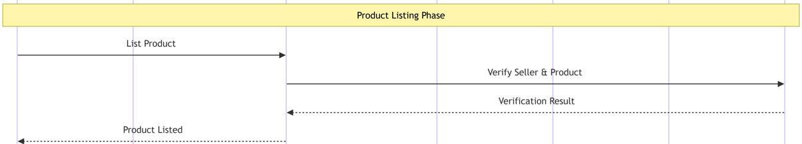
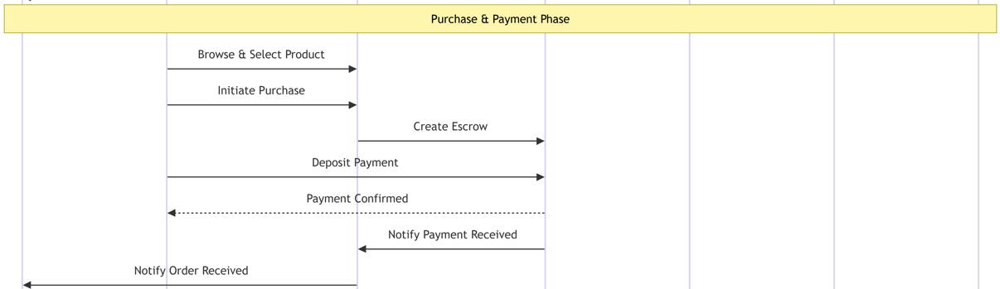
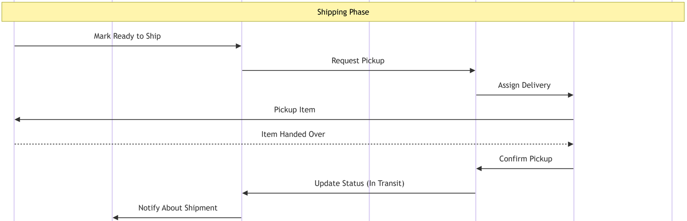
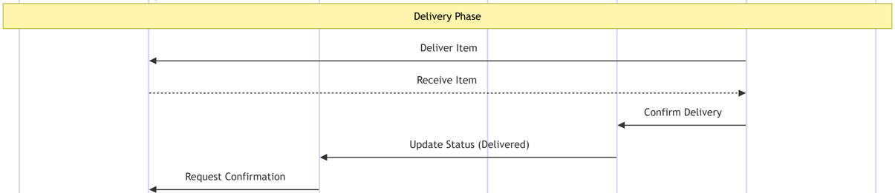
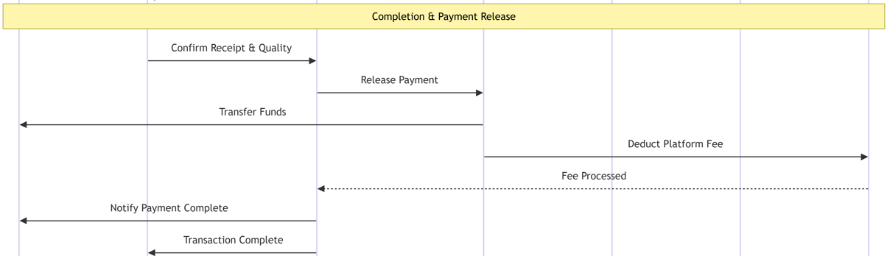
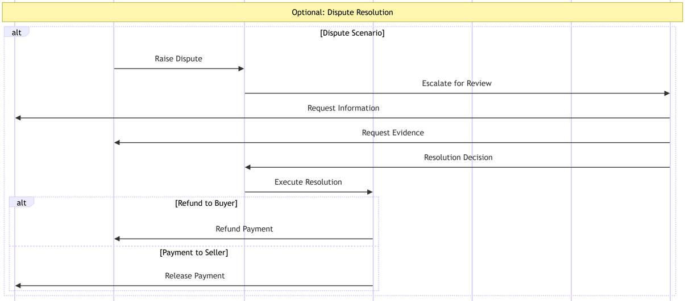

# C2C Online Marketplace

## Overview
This C2C marketplace coordinates a secure, multi-party transaction across distinct smart contracts and off-chain actors. A seller lists a product which is verified by a service provider before becoming visible to buyers. When a buyer commits to purchase, payment is held in an escrow contract to protect both sides. The marketplace orchestrates shipping via a courier contract, enabling status tracking from pickup to delivery. After the buyer confirms receipt, escrow releases funds to the seller and deducts the platform fee for the service provider. If issues arise, a formal dispute path collects evidence from both parties and executes a resolution via escrow. The design emphasizes escrow-backed security, transparent tracking, and governed dispute resolution.

---

## Phase 1: Product Listing

**Step 1: Seller initiates product listing**
- The seller submits product information (title, description, price, images) to the marketplace contract
- This is the entry point for any item to be sold on the platform

**Step 2: Marketplace requests verification**
- The marketplace contract forwards the listing details to the service provider for validation
- This ensures quality control and prevents fraudulent listings

**Step 3: Service provider validates seller credentials and product details**
- The service provider checks seller reputation, account status, and product compliance
- May include automated checks and manual review for sensitive categories

**Step 4: Product becomes visible on marketplace**
- Once verified, the marketplace contract makes the product searchable and visible to buyers
- Seller receives confirmation that their listing is live

---

## Phase 2: Purchase & Payment

**Step 5: Buyer browses marketplace and finds product**
- Buyer searches or browses the marketplace contract to discover products
- Views product details, seller ratings, and shipping information

**Step 6: Buyer commits to purchase**
- Buyer clicks "Buy Now" or similar action to initiate the purchase process
- This creates a pending order in the marketplace contract

**Step 7: Marketplace creates escrow for secure payment**
- The marketplace contract instantiates an escrow contract for this specific transaction
- Escrow acts as a neutral third party holding funds until delivery confirmation

**Step 8: Buyer deposits payment into escrow (not to seller directly)**
- Buyer transfers payment to the escrow contract, not directly to the seller
- This protects both parties - buyer gets refund protection, seller gets payment guarantee

**Step 9: Escrow confirms funds are secured**
- The escrow contract verifies the payment has been received and locked
- Buyer receives confirmation that their payment is safely held

**Step 10: Escrow notifies marketplace of successful payment**
- Escrow contract updates the marketplace contract with payment status
- Transaction can now proceed to fulfillment stage

**Step 11: Seller is informed to prepare shipment**
- Marketplace contract sends notification to seller that payment is secured
- Seller can now safely prepare and ship the item

---

## Phase 3: Shipping

**Step 12: Seller packages item and marks ready**
- Seller packages the product securely and marks it ready for pickup in the system
- This triggers the courier assignment process

**Step 13: Marketplace requests courier pickup**
- Marketplace contract sends pickup request to the courier contract with shipping details
- Includes pickup address, delivery address, package dimensions, and special instructions

**Step 14: Courier contract assigns delivery task**
- The courier contract matches the shipment with an available courier
- Assignment based on location, availability, and package requirements

**Step 15: Courier arrives at seller location**
- The assigned courier travels to the seller's specified pickup address
- May contact seller for coordination

**Step 16: Seller hands over packaged item**
- Seller physically transfers the package to the courier
- Courier may scan barcode or take photo as proof of pickup

**Step 17: Courier confirms possession of item**
- Courier updates the courier contract confirming successful pickup
- Package is now in courier's custody

**Step 18: Courier contract updates shipping status**
- Status changes from "preparing" to "in transit"
- Tracking information becomes available

**Step 19: Buyer receives shipment notification**
- Marketplace notifies buyer that item has been shipped
- Includes tracking number and estimated delivery date

---

## Phase 4: Delivery

**Step 20: Courier arrives at buyer location**
- Courier travels to the buyer's delivery address
- May attempt contact for delivery coordination

**Step 21: Buyer receives and inspects package**
- Buyer physically receives the package from courier
- May perform basic inspection for obvious damage

**Step 22: Courier confirms successful delivery**
- Courier records delivery completion in the courier contract
- May include signature, photo proof, or GPS confirmation

**Step 23: Courier contract updates final status**
- Status changes to "delivered" in the courier contract
- Timestamp recorded for delivery completion

**Step 24: Marketplace requests buyer confirmation**
- Marketplace contract prompts buyer to confirm receipt and quality
- Usually includes a deadline (e.g., 48-72 hours)

---

## Phase 5: Completion & Payment Release

**Step 25: Buyer confirms item quality and satisfaction**
- Buyer inspects the item thoroughly and confirms it matches description
- Approves the transaction for payment release

**Step 26: Marketplace authorizes payment release**
- Marketplace contract instructs escrow to release funds
- This happens only after buyer confirmation or timeout period

**Step 27: Escrow transfers funds to seller**
- Escrow contract releases the held payment to the seller's account
- Seller now receives payment for the completed transaction

**Step 28: Platform fee is deducted**
- Escrow contract calculates and transfers the platform commission
- Fee sent to service provider as revenue for marketplace operation

**Step 29: Service provider processes commission**
- Service provider receives and records the platform fee
- Confirms fee processing back to marketplace

**Step 30: Seller receives payment confirmation**
- Marketplace notifies seller that funds have been transferred
- Transaction is financially complete for the seller

**Step 31: Transaction is finalized**
- Marketplace confirms to buyer that the transaction is complete
- Both parties can now leave reviews and ratings

---

## Optional: Dispute Resolution Path

**Alternative Step A: Buyer raises dispute**
- If buyer is unsatisfied, they can raise a dispute before confirming receipt
- Common reasons: item not as described, damaged, wrong item, not received

**Alternative Step B: Marketplace escalates for review**
- Marketplace contract forwards the dispute to the service provider
- Dispute enters formal resolution process

**Alternative Step C: Service provider requests information from seller**
- Service provider asks seller for their side of the story
- May request proof of shipment, product details, or other evidence

**Alternative Step D: Service provider requests evidence from buyer**
- Buyer asked to provide photos, descriptions, or other proof
- Both parties given fair opportunity to present their case

**Alternative Step E: Service provider makes resolution decision**
- Based on evidence and policies, service provider decides outcome
- Decision could be full refund, partial refund, or payment to seller

**Alternative Step F: Marketplace executes resolution**
- Marketplace contract receives the decision and instructs escrow accordingly
- Resolution is implemented automatically

**Alternative Step G: Escrow executes refund or payment**
- Escrow contract releases funds according to the resolution decision
- Could be full/partial refund to buyer or payment to seller
- Transaction is closed with documented resolution

---

## Key Security Features

1. **Escrow Protection**: Payment held by neutral third party until delivery confirmed
2. **Verification System**: Service provider validates sellers and products before listing
3. **Tracking Integration**: Courier contract provides transparent shipping status
4. **Dispute Resolution**: Formal process for handling conflicts with evidence review
5. **Multi-party Validation**: No single party can unilaterally control the transaction flow