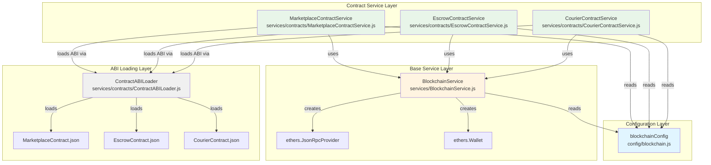

# Contract Services Architecture Diagram

This document illustrates the class interactions and dependencies within the contract services module.

## Class Dependency Diagram

### Mermaid Diagram (GitHub Compatible)



## Detailed Interaction Flow

### ASCII Diagram

```
┌─────────────────────────────────────────────────────────────────┐
│                    Application Layer                             │
│  (Controllers, Routes, Other Services)                           │
└────────────────────────┬────────────────────────────────────────┘
                         │
                         │ calls
                         ▼
┌─────────────────────────────────────────────────────────────────┐
│              Contract Service Layer                              │
│                                                                   │
│  ┌──────────────────┐  ┌──────────────────┐  ┌──────────────┐ │
│  │ Marketplace      │  │ Escrow           │  │ Courier      │ │
│  │ ContractService  │  │ ContractService  │  │ ContractService│ │
│  └────────┬─────────┘  └────────┬─────────┘  └──────┬───────┘ │
│           │                      │                    │          │
│           └──────────────────────┼────────────────────┘          │
│                                  │                                │
│                                  │ uses                            │
└──────────────────────────────────┼────────────────────────────────┘
                                   │
                                   ▼
┌─────────────────────────────────────────────────────────────────┐
│              Base Service Layer                                  │
│                                                                   │
│  ┌──────────────────────────────────────────────────────────┐   │
│  │          BlockchainService                               │   │
│  │                                                           │   │
│  │  • initialize()                                          │   │
│  │  • getProvider() → ethers.JsonRpcProvider                │   │
│  │  • getSigner() → ethers.Wallet                           │   │
│  │  • getContract(address, abi) → ethers.Contract (signed) │   │
│  │  • getContractReadOnly(address, abi) → ethers.Contract   │   │
│  │  • estimateGas(contract, method, ...args)                │   │
│  │  • sendTransaction(contract, method, value, ...args)     │   │
│  │  • parseError(error)                                     │   │
│  │  • formatAddress(address)                                │   │
│  │  • parseUnits/formatUnits(value, unit)                   │   │
│  └──────────────────────────────────────────────────────────┘   │
└─────────────────────────────────────────────────────────────────┘
                                   │
                                   │ uses
                                   ▼
┌─────────────────────────────────────────────────────────────────┐
│              ABI Loading Layer                                   │
│                                                                   │
│  ┌──────────────────────────────────────────────────────────┐   │
│  │          ContractABILoader                                │   │
│  │                                                           │   │
│  │  • loadContractABI(contractName)                         │   │
│  │    ├─→ Try to load from JSON file                        │   │
│  │    └─→ Fallback to minimal ABI if file not found         │   │
│  └──────────────────────────────────────────────────────────┘   │
│                                                                   │
│  Reads from:                                                      │
│  • contracts/MarketplaceContract.json                            │
│  • contracts/EscrowContract.json                                 │
│  • contracts/CourierContract.json                                │
└─────────────────────────────────────────────────────────────────┘
                                   │
                                   │ reads
                                   ▼
┌─────────────────────────────────────────────────────────────────┐
│              Configuration Layer                                 │
│                                                                   │
│  ┌──────────────────────────────────────────────────────────┐   │
│  │          blockchainConfig                                 │   │
│  │          config/blockchain.js                              │   │
│  │                                                           │   │
│  │  • rpcUrl                                                 │   │
│  │  • privateKey                                             │   │
│  │  • marketplaceContractAddress                              │   │
│  │  • escrowContractAddress                                   │   │
│  │  • courierContractAddress                                  │   │
│  │  • gasLimit, gasPrice, networkId                          │   │
│  │                                                           │   │
│  │  validateBlockchainConfig()                               │   │
│  └──────────────────────────────────────────────────────────┘   │
│                                                                   │
│  Reads from: .env file                                           │
└─────────────────────────────────────────────────────────────────┘
```

## Method Call Flow Example

### Example: Adding a Product

```
Application Code
    │
    │ MarketplaceContractService.addProduct(title, desc, price)
    │
    ├─→ getContract()
    │       │
    │       ├─→ initialize() (if not initialized)
    │       │       │
    │       │       ├─→ loadContractABI('MarketplaceContract')
    │       │       │       │
    │       │       │       └─→ ContractABILoader.loadContractABI()
    │       │       │               │
    │       │       │               ├─→ Try: Read JSON file
    │       │       │               └─→ Fallback: Return minimal ABI
    │       │       │
    │       │       └─→ BlockchainService.getContract(address, abi)
    │       │               │
    │       │               ├─→ getSigner()
    │       │               │       │
    │       │               │       ├─→ initialize() (if not initialized)
    │       │               │       │       │
    │       │               │       │       ├─→ validateBlockchainConfig()
    │       │               │       │       │       │
    │       │               │       │       │       └─→ Reads blockchainConfig
    │       │               │       │       │
    │       │               │       │       ├─→ new ethers.JsonRpcProvider(rpcUrl)
    │       │               │       │       └─→ new ethers.Wallet(privateKey, provider)
    │       │               │       │
    │       │               │       └─→ Returns signer
    │       │               │
    │       │               └─→ new ethers.Contract(address, abi, signer)
    │       │
    │       └─→ Returns contract instance
    │
    └─→ BlockchainService.sendTransaction(contract, 'addProduct', null, ...args)
            │
            ├─→ estimateGas(contract, 'addProduct', ...args)
            │       │
            │       └─→ contract.addProduct.estimateGas(...args)
            │
            ├─→ Calculate gasLimit (estimate + 10%)
            │
            ├─→ contract.addProduct(...args, { gasLimit, value })
            │       │
            │       └─→ Returns transaction object
            │
            └─→ tx.wait() → Returns receipt
```

## Class Responsibilities

### blockchainConfig
- **Purpose**: Centralized configuration management
- **Responsibilities**:
  - Load environment variables
  - Provide default values
  - Validate configuration

### BlockchainService
- **Purpose**: Base blockchain interaction layer
- **Responsibilities**:
  - Initialize ethers.js provider and signer
  - Create contract instances (signed and read-only)
  - Handle transaction sending with gas estimation
  - Provide utility functions for address/unit conversion
  - Error parsing and handling

### ContractABILoader
- **Purpose**: ABI loading and management
- **Responsibilities**:
  - Load contract ABIs from JSON files
  - Provide fallback minimal ABIs
  - Cache ABIs for performance

### MarketplaceContractService
- **Purpose**: Marketplace contract operations
- **Responsibilities**:
  - Product management (add, get)
  - Order management (create, get, fund)
  - Shipping coordination (markReadyToShip)
  - Receipt confirmation
  - Event querying

### EscrowContractService
- **Purpose**: Escrow contract operations
- **Responsibilities**:
  - Escrow funding
  - Escrow status queries
  - Fund release to seller
  - Delivery status updates

### CourierContractService
- **Purpose**: Courier contract operations
- **Responsibilities**:
  - Pickup request creation
  - Pickup confirmation
  - Delivery confirmation
  - Shipment status queries

## Data Flow

```
Environment Variables (.env)
    │
    ▼
blockchainConfig
    │
    ├─→ BlockchainService.initialize()
    │       │
    │       ├─→ Creates Provider (read blockchain)
    │       └─→ Creates Signer (write to blockchain)
    │
    └─→ Contract Services
            │
            ├─→ ContractABILoader.loadContractABI()
            │       │
            │       └─→ Returns ABI array
            │
            └─→ BlockchainService.getContract(address, abi)
                    │
                    └─→ Returns ethers.Contract instance
                            │
                            └─→ Used for contract method calls
```

## Initialization Sequence

```
1. Server starts
   │
   ├─→ server.js imports BlockchainService
   │
2. BlockchainService.initialize() called
   │
   ├─→ validateBlockchainConfig()
   │       │
   │       └─→ Reads blockchainConfig
   │
   ├─→ new ethers.JsonRpcProvider(rpcUrl)
   │
   └─→ new ethers.Wallet(privateKey, provider) [if privateKey exists]
   
3. Contract Service first use (lazy initialization)
   │
   ├─→ ContractService.getContract() called
   │       │
   │       ├─→ ContractService.initialize()
   │       │       │
   │       │       ├─→ loadContractABI(contractName)
   │       │       │       │
   │       │       │       └─→ ContractABILoader.loadContractABI()
   │       │       │
   │       │       └─→ BlockchainService.getContract(address, abi)
   │       │
   │       └─→ Contract instance cached
```

## Key Design Patterns

1. **Singleton Pattern**: All services use static methods and cache instances
2. **Lazy Initialization**: Services initialize only when first used
3. **Dependency Injection**: Services depend on BlockchainService and Config
4. **Factory Pattern**: BlockchainService creates contract instances
5. **Strategy Pattern**: ContractABILoader provides fallback strategy for ABI loading
